|

Information Technology Institute

Embedded Systems Track

**Controlled Car with Infotainment System**

|
| :-: |
|
Submitted by :

Ahmed Ali Hassan Ali

Bassem Amgad Ahmed Atef

Hossam ElDin Magdy Ahmed Hassinen

Nihal Khaled Mohammed Mohammed

Roanne Khaled Mohammed Mohammed

Shrouk Magdy Ibrahim Zaki
|
|
Under Supervision of

Eng. Ahmed El\_Ashmawy
|

`     `Date

June 2021

` ` [**Introduction](#_c788hrhn2jkd) 

[Description](#_z5p5vbmputsn)

[Features](#_7tn50cqz35fx)

[Car Control GUI](#_z85x6zg3u9ic)

[Infotainment GUI](#_at1su2x6skf5)

[**Car control](#_6l8xnyiuje9l)

[Setup and configuration](#_b4pop8h0y0e)

[Hardware Components](#_pgvlbustzgc4)

[Schematic Diagram](#_fkq5er55uvb4)

[Manual mode](#_rdkyy9spemy2)

[Self driving mode](#_332yboyp6pxl)

[Algorithm](#_ib3vwgbib6ci)

[Steps:](#_d3rpz543m5tz)

[**Infotainment system](#_t2km524ltydq)

[What is In-vehicle infotainment?](#_30j0zll)

[Setting the required Raspbian image configurations](#_sstxkfujxz9p)

[Configure LCD with Raspberry Pi](#_3rdcrjn)

[Configure Camera with Raspberry Pi](#_trwy6whdfbt)

[Setting QT Platform:](#_yiilrv7mxalv)

[What is Qt ?](#_qgxt4tbrpyl8)

[Qt for Embedded Linux](#_26in1rg)

[Signals & Slots](#_lnxbz9)

[Installed Libraries:](#_chbm2tmhyhjr)

[Used Classes :](#_1u7ih3yeel8d)

[Hardware Components](#_9surg09csf77)

[Entertainment Services](#_p3a1kllpv29g)

[Information Services](#_3nlwsagmgfnr)

[**References](#_mtq4bcrvnix8)

[**Future](#_ff4xucjqa9in)

#
# Introduction
## Description
Controlling the movement of the car remotely with a QT5  based GUI tool on the laptop. While offering the user a playful and luxurious infotainment system with features like mp3, mp4 and bluetooth connection to mobile. 
## Features
### Car Control GUI
1. Car control GUI can be used remotely using WIFI
1. Supports manual maneuvering for the car through the GUI either using keyboard or mouse
1. ` `Speed is changeable 
1. Supports self driving according to specific path , by selecting start and destination point
### Infotainment GUI
1. Supports mp3 , mp4
1. Supports using the camera for rear scene and the camera is on if the car is moving backward
1. Supports setting time and date
# Car control
Controlling the movement of the car with a GUI tool on the laptop . The GUI tool is made using QT5 , for manual mode, it will have 4 arrows (forward , backward, left,right) and for self driving mode , the car moves on a specific path from the start point of the user’s choice till the destination .
The 4 motors of the car will be working on the raspberry pi. The communication between the tool and the raspberry pi in the car will be through WIFI.

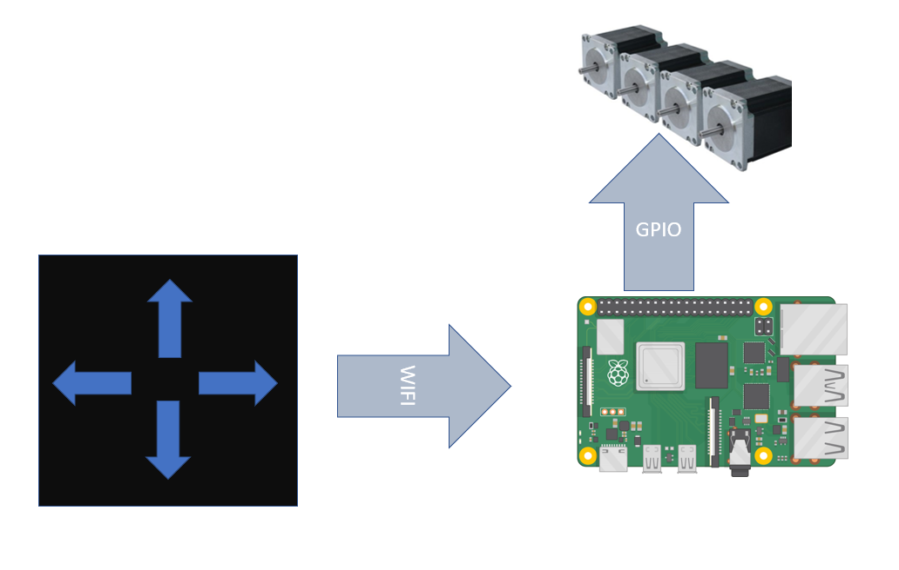

Figure (1) Block Diagram
## Setup and configuration
- Pi version : Raspberry Pi 3 Model B
- Image used on raspberry pi is raspbian
- WIFI connection 
  - Ssh has to be enabled
  - WIFI connection has to be configured by adding the WIFI source information in “/etc/wpa\_supplicant/wpa\_supplicant.conf” as the following

network={

ssid="Name"

psk="pass"

}

- Enable VNC at startup of the pi so the GUI is allowable to open
- There is another way to access the pi remotely using “remotit” 

<https://app.remote.it/>

- Qt version : 5.11.3
## Hardware Components
- Raspberry Pi

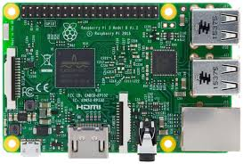

Figure (2) Raspberry Pi

- 3 Dc motors 12v - 13500rpm

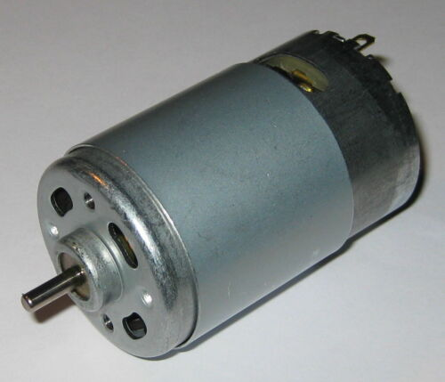

Figure (3) DC Motor

- 2 MD10C R3.0 10Amp DC Motor Driver

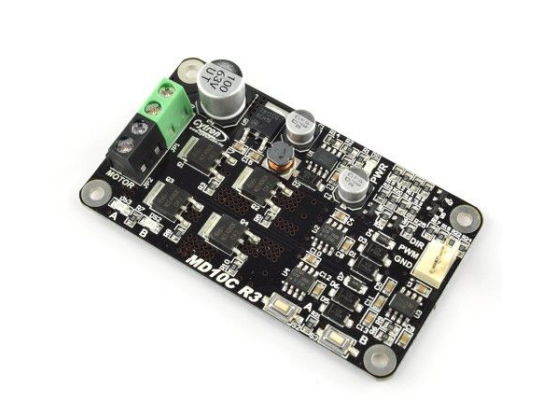

Figure (4) Motor Driver

- 2 Batteries 12v - 9A

Figure (5) Battery
## Schematic Diagram
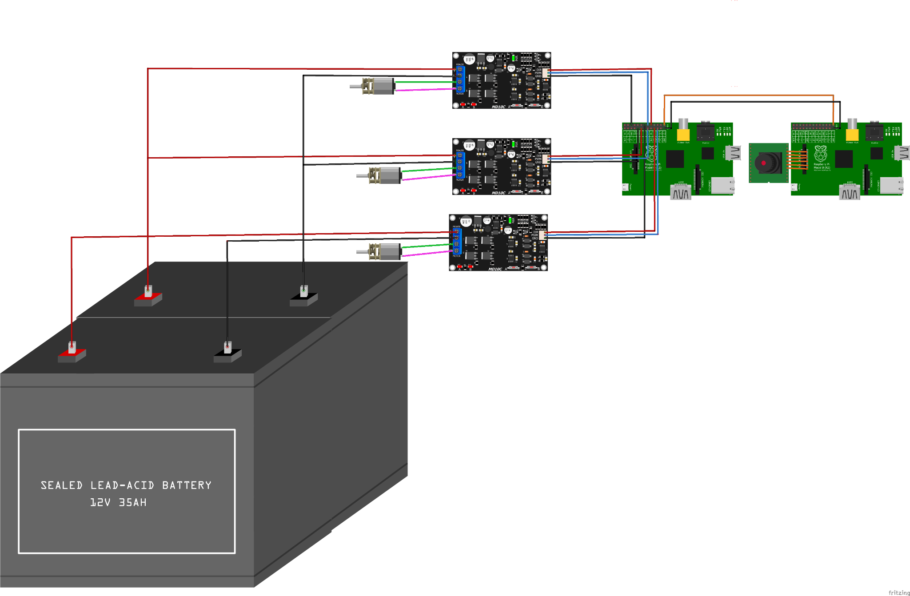

Figure (6) Schematic
## Manual mode
This mode allows controlling the car movement and its speed. 

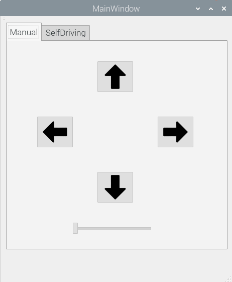

Figure (7) Manual Mode GUI

The GUI contains:

- ` `4 pushbuttons (arrows)
  - ` `representing the four direction forward , backward , turn right and turn left 
  - The buttons can be controlled by keyboard or mouse
  - The buttons using the keyboard can be configured to use any four buttons.

The configured buttons are ‘w’ for forward , ‘s’ for backward , ‘a’ for turning left and ‘d’ for turning right

- The buttons moves the car as pressed , when released , the car stops
- Keyboard arrows are used for navigation in the GUI
- Horizontal slider 
  - Used to change the speed
  - The slider has 3 steps

0 means speed is zero

1 means speed is 20 rpm

2 means speed is 40 rpm
## Self driving mode
The mode is used for moving the car from start location to destination depending on the user’s choice and the path is generated depending on an algorithm.

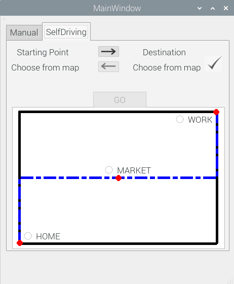

Figure (8) Self Driving Mode GUI

The GUI contains:

- 4 labels for start location and destination

The lower labels change depending on the user’s choice

- 2 pushbuttons (arrows) between the location labels to edit locations
- Push Button with right symbol for confirmation of locations selection and by pressing this button , the path is shown on the map
- Push button named “GO” , by pressing this button , the car starts moving to destination
- A map shows the roads and available locations , it also shows the path that the car will use for moving 
## Algorithm
The map is composed of roads and the intersections between the roads have to be the start or the end of a road , also the intersections have to be between two roads only.
### Steps:
- First the user selects the start point from the map, then pressing the right arrow to choose the destination 
- The label of start location changes its text depending on the selection , then the user chooses the destination from th map
- By pressing the confirm button , the path is shown on the map
- The user can edit the locations before or after pressing the confirm button by pressing the arrows buttons
- Pressing the “GO” button the car starts to move till destination over the path
  - The car starts from the start location and its orientation has to be in the right direction
  - The car starts moving step by step checking after each step if it has reached the destination. The step is configured 1 meter
  - The car continues checking the orientation of the road , direction of movement is incremental or decremental and if the car reaches an intersection , depending on all of that the car decides the right direction to take the next step
  - If the car reaches an intersection , the car checks the orientation of the current road , the other road and the direction of movement to decide the next turn if it will be right or left
  - By checking all of these conditions after each step , the car reaches the destination

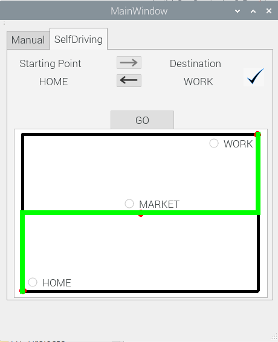

Figure (9) Path shown on map
# Infotainment system
With the growing demand for luxurious, safe, and smart vehicles, automotive manufacturers are increasingly developing automobiles with integrated infotainment systems – systems that provide a combination of entertainment and information for an enhanced in-vehicle experience.
## What is In-vehicle infotainment?
The IVI (In-vehicle infotainment ) can be described as a combination of vehicle systems which are used to deliver entertainment and information to the driver and the passengers through audio/video interfaces, back-up camera, speedometer and control elements like touch screen displays, button panel, voice commands, and many other features.

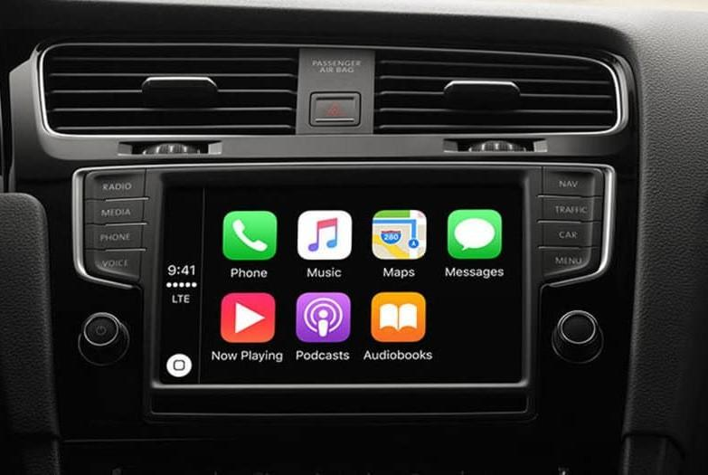

Figure (10) Infotainment System

## Setting the required Raspbian image configurations
1. Download .zip Raspbian image which is around 1Gb .img file and unzip it.
1. Insert SDCard into your PC and discover it with:

*$ dmesg* 

This name should be /dev/mmcblk0 or /dev/sdX.

1. Flash the Raspbian image on the sd-card.

*$ sudo dd bs=4M if=<path of  Raspbian image > of=/dev/mmcblk0   status=progress*

1. Configure UART

`            `1. Edit Boot/Config.txt and the following line:

`                         `*enable\_uart=1*

1. Configure SSH

`  `*1.  Change directory to rootfs -> etc and change Permissions*

`                   `*$ sudo chmod 777 dhcpcd.conf*

`           `2. Edit dhcpcd.conf & configure static Ip :

`		`*interface eth0*

`	         `*static ip\_address=192.168.2.15/24*

`           `3. Change directory to rootfs -> etc -> ssh and change Permissions 

`                   `*$ sudo chmod 777 sshd\_config*

`           `4. Open sshd\_config & edit these lines :

`	        `PermitRootLogin prohibit-password  ->  PermitRootLogin yes

1. ` `Login to Rpi using Uart 

`                 `*$ sudo screen /dev/ttyUSB0 115200*

1. In Rpi:

`       `*1.  $ sudo raspi-config* 

\2. Choose Display Option   ->  Resolution  -> DMT Mode 82

`	       `3. Choose Interface Option -> Enable SSH

`	       `4. Choose Interface Option -> Enable VNC.

`                `5. Finish

1. On your Pc:

`              `1. Connect Ethernet between Rpi and Pc

`              `2. Configure static Ip:

`                                   `192.168.2.20

1. Install VNC Viewer and connect to RPI through ip 192.168.2.15.
## Configure LCD with Raspberry Pi 
Raspberry Pi board should be connected to the Internet during the installation.

1. ` `Obtain the LCD driver
1. Log onto the Raspberry Pi users system to command line 
1. Get the newest driver from GitHub(Raspberry Pi LCD should be connected to internet)

*sudo rm -rf LCD-show*

*git clone https://github.com/goodtft/LCD-show.git*

*chmod -R 755 LCD-show*

*cd LCD-show/*

1. install LCD driver

\# In case of 7inch HDMI Display-B-800X480(MPI7001):

*sudo ./LCD7B-show*

\# In case of 7inch HDMI Display-C-1024X600(MPI7002):

*sudo ./LCD7C-show*

Wait for a moment after executing the above command, then you can use the corresponding raspberry LCD.
## Configure Camera with Raspberry Pi 
` `Login In to Rpi:

`         `*1.  $ sudo raspi-config* 

`         `2. Choose Interface Option -> Enable Camera.
## Setting QT Platform:
### What is Qt ?
- Qt is a cross-platform application development framework for desktop, embedded and mobile.[ Supported Platforms](https://wiki.qt.io/Supported_Platforms) include Linux, OS X, Windows, VxWorks, QNX, Android, iOS, BlackBerry, Sailfish OS and others.
- Qt is not a programming language on its own. It is a framework written in C++. A preprocessor, the[ MOC (Meta-Object Compiler)](http://doc.qt.io/qt-5/moc.html), is used to extend the C++ language with features like[ signals and slots](http://doc.qt.io/qt-5/signalsandslots.html)
- Before the compilation step, the MOC parses the source files written in Qt-extended C++ and generates standard compliant
- Qt Provide a huge variant of libraries such as :

Timers , Push Buttons , Widgets , Videos , Audio and much more 
### Qt for Embedded Linux
Qt for Embedded Linux is a C++ framework for GUI and application development for embedded devices. It runs on a variety of processors, usually with Embedded Linux. Qt for Embedded Linux provides the standard Qt API for embedded devices with a lightweight window system.

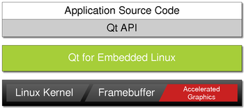

Figure (11) QT

Qt for Embedded Linux applications write directly to the framebuffer, eliminating the need for the X Window System and saving memory. The Linux framebuffer is enabled by default on all modern Linux distributions.
## Signals & Slots
- Signals and slots are used for communication between objects. The signals and slots mechanism is a central feature of Qt
- In GUI programming, when we change one widget, we often want another widget to be notified. More generally, we want objects of any kind to be able to communicate with one another. For example, if a user clicks a Close button, we probably want the window's[ close()](https://doc.qt.io/qt-5/qwidget.html#close) function to be called.
- In Qt, we have an alternative to the callback technique: We use signals and slots. A signal is emitted when a particular event occurs. Qt's widgets have many predefined signals, but we can always subclass widgets to add our own signals to them. A slot is a function that is called in response to a particular signal. Qt's widgets have many predefined slots, but it is common practice to subclass widgets and add your own slots so that you can handle the signals that you are interested in.

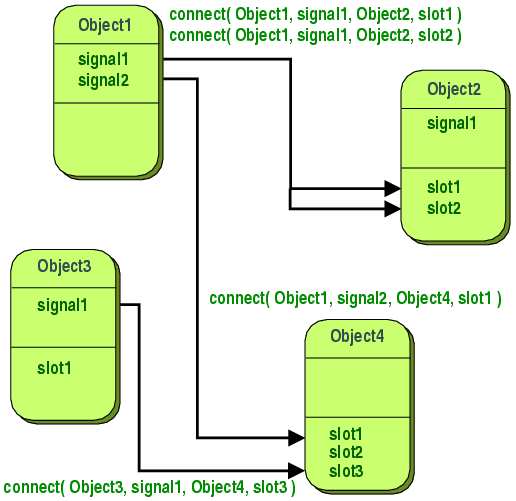

Figure (12) Signals and Slots
### Installed Libraries:
Multimedia(Videolib - Audiolib)

*$ sudo apt-get install qtmultimedia5-dev libqt5multimediawidgets5 libqt5multimedia5-plugins libqt5multimedia5 gstreamer1.0-pulseaudio* 

Check if gstreamer libraries is downloaded, if not:

*$sudo apt-get install gstreamer1.0-tools*
#### Used Classes :
\#include \<QMainWindow\>

\#include \<QMediaPlayer\>

\#include \<QMediaPlaylist\>

\#include \<QTimer\>

\#include \<QString\>

\#include \<QSlider\>

\#include \<QScrollArea\>

\#include \<QVBoxLayout\>

\#include \<QPushButton\>

\#include \<QComboBox\>

\#include \<QSplashScreen\>

\#include \<QVideoWidget\>

\#include \<QCamera\>
## Hardware Components
- Raspberry Pi

Figure (13) Raspberry Pi

- Raspberry Pi camera module V2

`     `*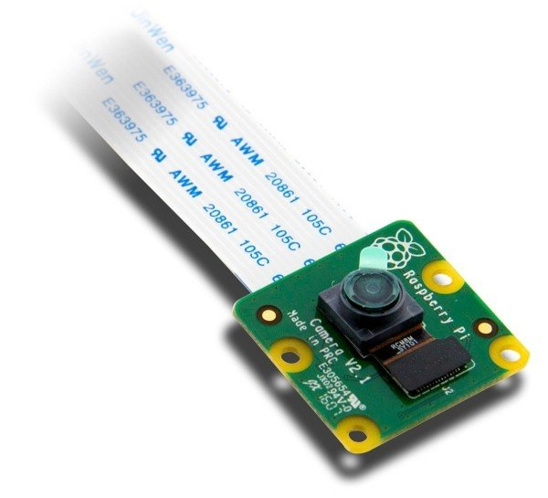*

Figure (14) Camera Module

- Speakers

`         `**

Figure (15) Speaker

- 7-inch Capacitive Touch Screen LCD (B) 

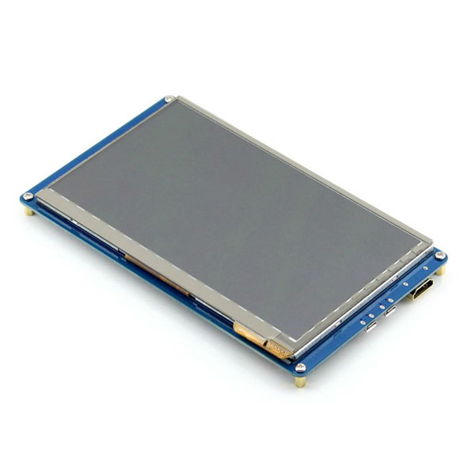

Figure (16) LCD

***Main Features of IVI***

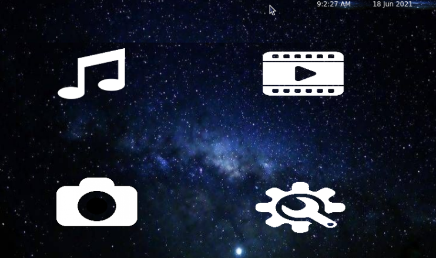

Figure (17) IVI GUI

Entertainment Services

1. MP3
1. MP4

Information Services

1. Rear view Camera
1. Settings Panel

### Entertainment Services
1. **MP3**

Music players are media software that are specifically designed to store and play audio files either through speakers or headphones connected to the raspberry pi.

`             `**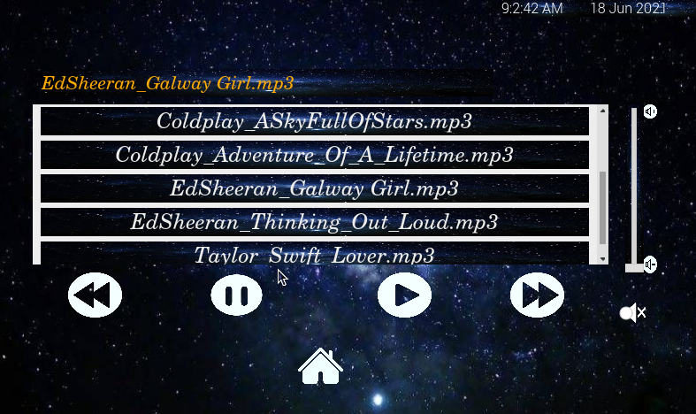**

Figure (18) MP3 GUI

1. **MP4**

Video players are media software that are able to play music and display videos on the Lcd through HDMI and USB cables.

`                  `**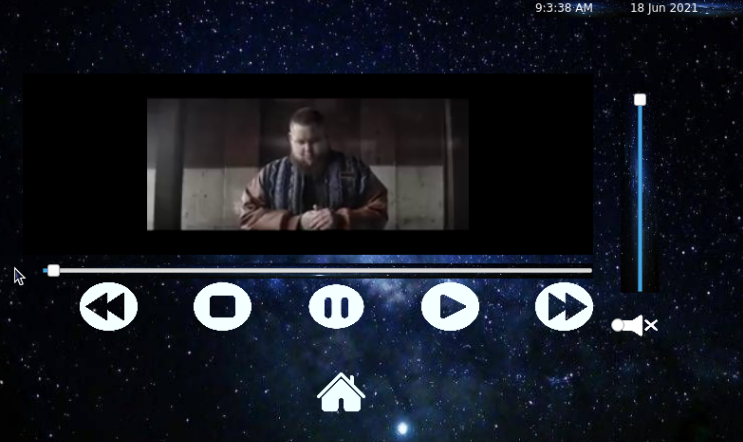**

Figure (19) MP4 GUI
### Information Services
1. **Rear view Camera**

The camera widget will be opened when the car moves backward.

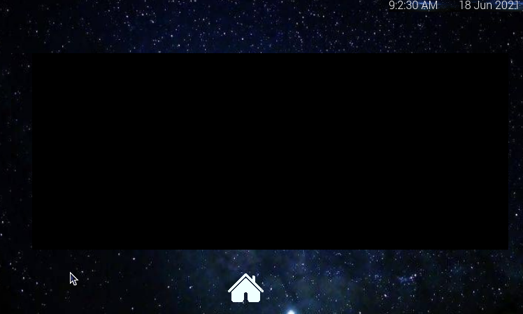

Figure (20) Camera GUI

1. **Settings Panel**

Settings panel configures the Date and Time , any missing data will be not updated and a warning message will be displayed on the Lcd.

`     `**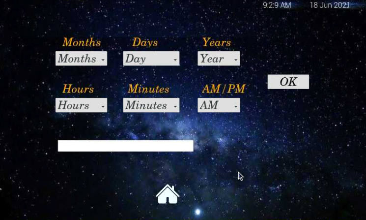**

Figure (21) Setting GUI
# References
- *Motor driver datasheet,* Available at: [*https://images-na.ssl-images-amazon.com/images/I/A1TemgvjKjL.pdf*](https://images-na.ssl-images-amazon.com/images/I/A1TemgvjKjL.pdf)
- *Qt5 C++ GUI Programming Cookbook PDF, Available at: [https://oiipdf.com/qt5-c-plus-plus-gui-programming-cookbook*](https://oiipdf.com/qt5-c-plus-plus-gui-programming-cookbook)*
- *QT installation, Available at: [https://www.raspberrypi.org/forums/viewtopic.php?t=69163*](https://www.raspberrypi.org/forums/viewtopic.php?t=69163)*
- *QT documentation, Available at: [https://doc.qt.io/qt-5.15/*](https://doc.qt.io/qt-5.15/)*
- [*http://www.lcdwiki.com/7inch_HDMI_Display-B*](http://www.lcdwiki.com/7inch_HDMI_Display-B)
- [*https://pinout.xyz/#*](https://pinout.xyz/#)
- [*https://cdn.sparkfun.com/datasheets/Dev/RaspberryPi/RPiCamMod2.pdf*](https://cdn.sparkfun.com/datasheets/Dev/RaspberryPi/RPiCamMod2.pdf)
- [*https://www.raspberrypi.org/documentation/hardware/camera/*](https://www.raspberrypi.org/documentation/hardware/camera/)

# Future
- Object detection (camera - ultrasonic)
- stop self driving mode while running for emergency
- Using advanced map and algorithm
- GPS , Google maps
- Auto Parking
- In-Vehicle Connectivity
- *Good voice controls*
- *Internet Connectivity - mobile hotspots, factory firmware, and software system updates*
PAGE
